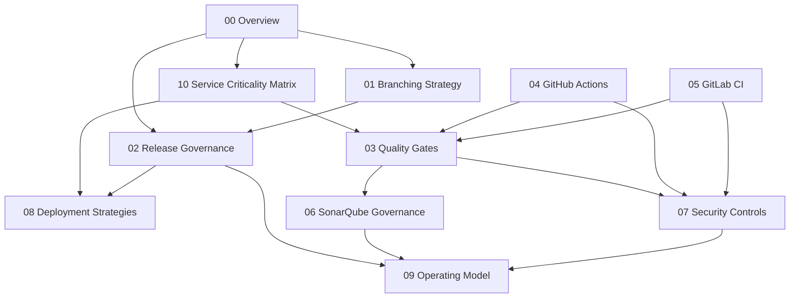

# Documentacion - enterprise-cicd-governance-blueprint

## Objetivo del blueprint
Este portal organiza un marco de gobierno CI/CD enterprise para plataformas transaccionales de alta criticidad (Fintech/Payments), alineando calidad, seguridad, release governance y operacion de delivery.

## Estructura del file system
- 00-overview.md: vision, principios y glosario operativo.
- 01-branching-strategy.md: estrategia de ramas y politicas de merge.
- 02-release-governance.md: promotion model y aprobaciones por riesgo.
- 03-quality-gates.md: criterios minimos de calidad para merge/release.
- 04-github-actions-reference.md: referencia de pipeline en GitHub Actions.
- 05-gitlab-ci-reference.md: referencia de pipeline en GitLab CI/CD.
- 06-sonarqube-governance.md: perfiles, gates y gobierno de deuda.
- 07-security-controls.md: controles de seguridad de supply chain.
- 08-deployment-strategies.md: estrategias de despliegue y rollback.
- 09-operating-model.md: operating model y ownership de governance.
- 10-service-criticality-matrix.md: matriz de criticidad por tier y controles.

## Orden recomendado de lectura por rol

### Platform Engineer
1. 00-overview.md
2. 10-service-criticality-matrix.md
3. 03-quality-gates.md
4. 04-github-actions-reference.md
5. 05-gitlab-ci-reference.md
6. 07-security-controls.md

### Product Delivery Manager
1. 00-overview.md
2. 02-release-governance.md
3. 09-operating-model.md
4. 10-service-criticality-matrix.md
5. 08-deployment-strategies.md

### Solution/Platform Architect
1. 00-overview.md
2. 10-service-criticality-matrix.md
3. 01-branching-strategy.md
4. 02-release-governance.md
5. 06-sonarqube-governance.md
6. 09-operating-model.md

## Mapa de dependencias (conceptual)

